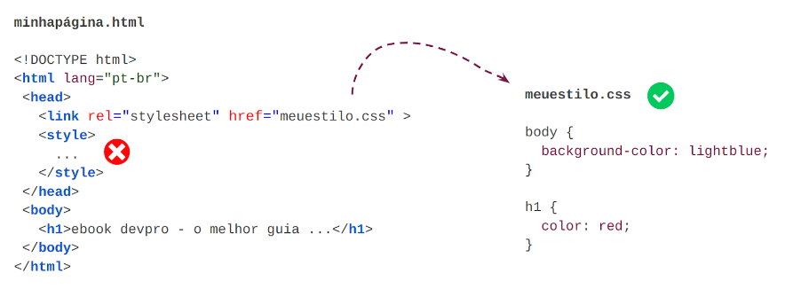
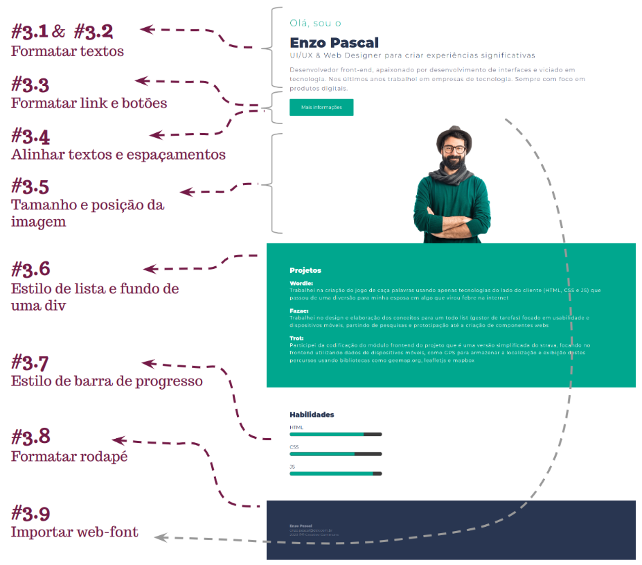
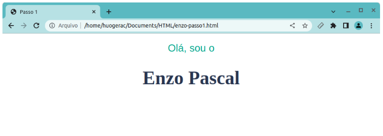
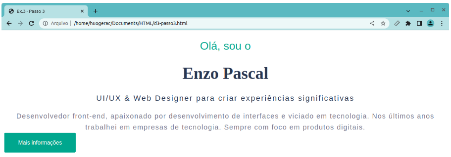
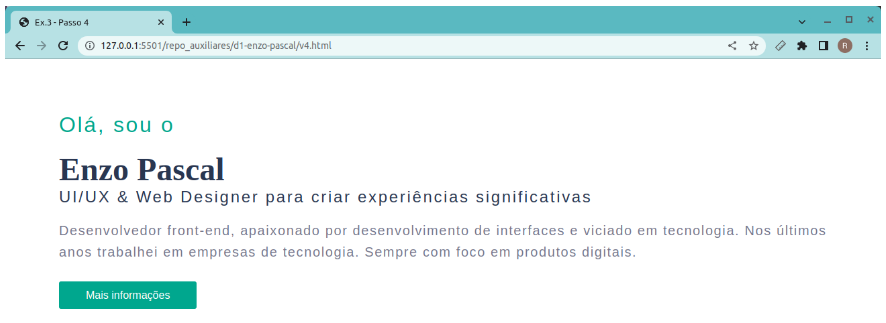
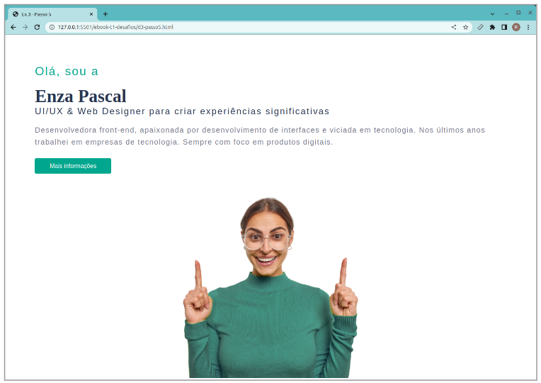
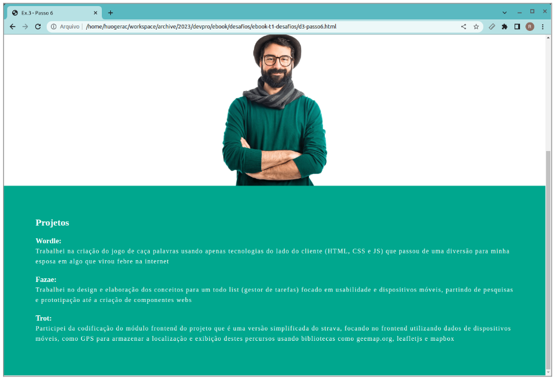
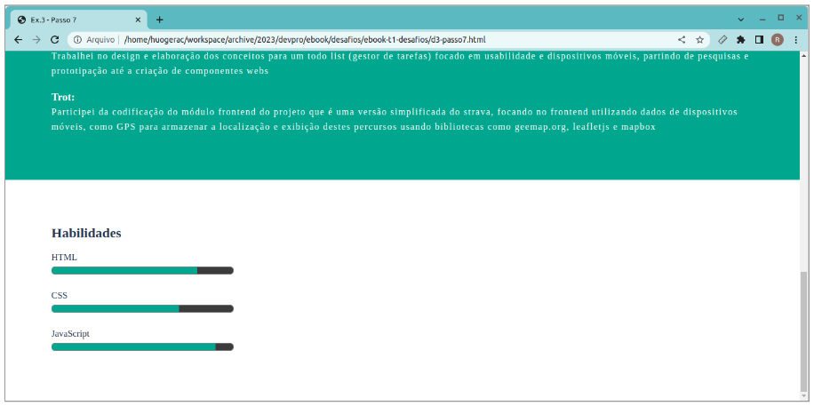
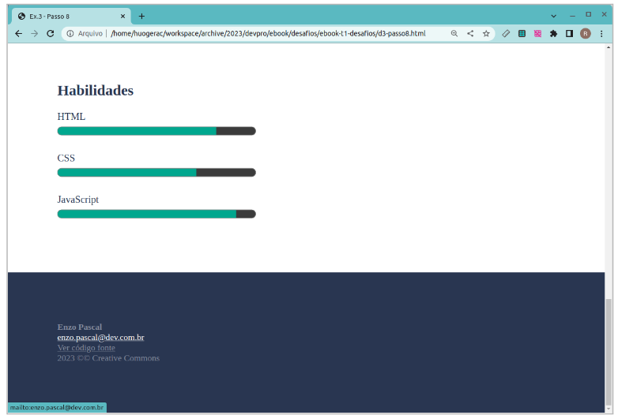
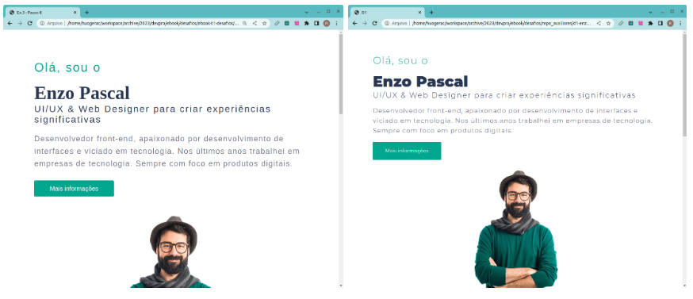

# Guia Definitivo Do Zero à Dev - EXERCÍCIOS

## Fundamentos do CSS

### 🏆 1 - CSS na prática

Crie um novo arquivo HTML chamado css-tag-style.html e faça ficar parecido com a imagem abaixo:


### 🏆 2 - Estilo inline, Tag Style e arquivos externos

Converta o exemplo acima de forma que o estilo CSS ficará em um arquivo externo



### 🏆 3 - Página do Enzo Pascal

O objetivo final é construir uma página simples, porém funcional. Mas para isto, iremos quebrar este desafio em 9 partes menores.



### 🏆 3.1 - Estilo no título



Passos:

- Crie o arquivo enzo-passo1.css
- Crie o arquivo enzo-passo1.html com a estrutura base do HTML (que vimos na parte de HTML) e importe o CSS de estilo enzo-passo1.css
- Dentro do body, coloque os textos da imagem utilizando um `<h2>` e `<h1>` respectivamente
- A cada alteração feita nos arquivos, abra no navegador e atualize a página para ver o resultado
- -Veja no mapa mental anterior e localize a propriedade que altera o tamanho, depois use os tamanhos 26px e 48px respectivamente
- Também localize a propriedade que altera a cor e utilize as cores #00a78e e #293651
- No subtítulo vamos precisar trocar a fonte para uma que não tem serifa, utilize a propriedade font-family: sans-serif;
- No título vamos precisar deixar o texto negrito, utilize a propriedade font-weight: bold;
- Em todos os textos vamos precisar centralizar, procure no mapa mental a propriedade para esta finalidade e aplique de forma a deixar todos elementos centralizados
- Se seu CSS e HTML estiverem sem erros, sua página deverá estar igual a da imagem acima, se algo deu errado, é melhor verificar primeiramente a sintaxe, ou seja, ver se todas as tags do HTML estão abrindo e fechando, se o CSS está sendo importado corretamente, se não faltou um ponto e vírgula no final de cada propriedade CSS etc…

### 🚀 Dica DEV #1 - Editor de código

Utilize um editor de código, como o VSCODE

### 🏆 3.2 - Mais estilo nos textos


Passos:

- Crie o arquivo enzo-passo2.css com o conteúdo das regras de estilo acima
- Crie o arquivo enzo-passo2.html com as marcações acima, note que o `<head>` do código acima está incompleto
- Crie um elemento `<h3>` com a classe subtitle2 para formatar o texto “UI/UX & Web Designer …”
- A cada mudança abaixo, salve o arquivo e atualize o navegador para ir vendo de forma incremental as alterações
- Crie um parágrafo com a classe text para adicionar o texto: “Desenvolvedor front-end, apaixonado …”
- A cor da fonte do subtitle2 é a mesma do título, o tamanho será 22px, o peso da fonte será 300 e para um melhor espaçamento entre letras, utilize um ajuste fino com a propriedade: letter-spacing: 2pt;. Utilize a família da fonte sem serifa (sans-serif)
- O parágrafo tem a cor #76778c;, tamanho 20px, fonte também sem serifa e adicione também um letter-spacing: 1.2pt;
- Ainda na classe .text e para melhorar o espaçamento ou distância com o texto anterior, adicione um line-height: 32px;
- Note que na imagem acima, os textos estão centralizados, se tiver algum elemento não centralizado, adicione a propriedade que faz isto
- Se seu CSS e HTML estiverem sem erros, sua página deverá estar igual a da imagem acima, se algo deu errado, verifique a sintaxe do HTML e do CSS, tenha certeza que os arquivos foram salvos e atualize seu navegador.

### 🚀 Dica DEV #2 - Codepen

Estamos em um nível que já começamos a fazer as primeiras páginas e queremos mostrar para outras pessoas, obter feedback e quem sabe entender onde podemos melhorar, não faz sentido?

Estamos precisando de uma plataforma para salvar nosso trabalho na internet. É aí que entra a plataforma [CodePen](https://codepen.io). Primeiramente será necessário criar uma conta, utilize o botão Sign Up na página principal ou acesse diretamente o link: https://codepen.io/accounts/signup/user/free.

### 🏆 3.3 - Formatando links e botões



Passos:

- Crie os arquivos d3-passo3.html e d3-passo3.css
- Tenha certeza que o CSS é importado na página
- Digite ou copie as marcações e o estilo deste CodePen aqui (https://codepen.io/huogerac/pen/LYJjdvE)
- Crie o elemento `<a href="#" class="btn">Mais informações</a>`
- Adicione a classe .btn no arquivo CSS
- Crie o estilo para a tag `<a>` conforme as dicas de propriedades abaixo:

- background-color: É a propriedade que adiciona uma cor de fundo em qualquer elemento HTML, assim como color, podemos colocar a cor no formato texto, por exemplo, background-color: blue; no formato RGB background-color: rgb(0, 0, 255); ou no formato Hexadecimal background-color: #0000ff; Nossa página do Enzo Pascal utiliza a uma variação da cor ciano: #00a78e;

- border-radius: É a propriedade que deixa os cantos arredondados, onde o valor border-radius: 1px; faz um arredondamento de 1px o que é quase zero, uma sugestão é ir aumentando este valor até ficar parecido com o botão acima

- padding: É a propriedade que adiciona um espaço interno a qualquer elemento HTML, para deixar o botão maior usando espaço interno, vamos adicionar 20px; na parte de cima e na parte de baixo (eixo x) e 40px nas laterais (eixo y), então a propriedade final fica assim: padding: 20px 40px;

- text-decoration: É a propriedade que permite alterar o decorator padrão de links (text-decoration: underline;). Procure no seu site de busca pelo termo: "text-decoration MDN", esta é a forma de procurar sobre a documentação do site da Mozilla sobre qualquer propriedade CSS. Tente achar o valor desta propriedade para desligar o underline.

Com as alterações das propriedades acima, falta agora apenas alterar as propriedades que já conhecemos, são elas: Propriedade de tamanho, cor da fonte e família da fonte. Sem passar mais detalhes, tente descobrir os valores de cada uma dessas propriedades de forma a deixar o botão o mais próximo possível da imagem deste exercício.

### 🚀 Dica DEV #3 - Chrome Dev Tools

O Chrome DevTools é um conjunto de ferramentas para desenvolvimento web, ela já vem instalada no navegador Google Chrome. Com o DevTools podemos olhar detalhes de qualquer página, modificar e ver o resultado da alteração em tempo real. É a ferramenta ideal para nos ajudar a testar propriedades novas ou para ajudar a entender por que alguma coisa não está funcionando como esperado.

### 🏆 3.4 - Alinhar textos e espaçamentos



### 🏆 3.5 - Tamanho e posicionar imagem



Passos:

- Crie os arquivos d3-passo5.html e d3-passo5.css
- Tenha certeza que o d3-passo5.css é importado na página
  -Compare o resultado do seu exercício #3.4 com as marcações e o estilo deste CodePen aqui (https://codepen.io/huogerac/pen/KKxZmqE). Sua página inicial tem que ficar o mais próximo possível desta página.
- Adicione o atributo src na tag `` apontando para a imagem do Enzo ou da Enza Pascal. Para isto temos duas opções, baixar a imagem e colocá-la na mesma pasta do seu arquivo html ou adicionar o endereço da imagem na internet diretamente no atributo src.
- Enza Pascal pode ser baixada aqui (https://raw.githubusercontent.com/devpro-br/ebook-t1-desafios/main/images/hero-enza.png)
- Enzo Pascal pode ser baixado aqui (https://raw.githubusercontent.com/devpro-br/ebook-t1-desafios/main/images/hero-enzo.png)
- A imagem têm as dimensões original de 676 x 652 pixels (tamanho x altura), podemos utilizar as propriedades width e height para alterá-las e assim exibir a imagem na página maior ou menor que seu tamanho original.
- Utilize a ferramenta DevTools para alterar o width e height da imagem de forma a chegar no tamanho desejado. Veja a seção de dicas
- Precisamos centralizar a imagem, mas note que se colocarmos o text-align: center diretamente na imagem, nada irá mudar. Tente colocar a imagem dentro de uma tag `<div>` e centralizar o conteúdo da div ao invés da imagem diretamente.

### 🏆 3.6 - Estilo de lista e cor de fundo



- Crie os arquivos d3-passo6.html e d3-passo6.css
- Tenha certeza que o d3-passo6.css é importado na página
- Compare o resultado do seu exercício #3.5 com as marcações e o estilo deste CodePen aqui (https://codepen.io/huogerac/pen/VwGJapg). Sua página inicial tem que ficar o mais próximo possível desta página.
- Adicione inicialmente uma nova região utilizando a tag `<div class="parte2">`
- Adicione um `<h2>` para o texto Projetos
- Adicione uma lista não ordenada `<ul>` com três `<li>`, um para cada projeto
- Dentro de cada item, vamos precisar de um `<h3>` e um `<p>` para acomodar o título de projeto e seu respectivo conteúdo
- Na classe .parte2, utilize o background-color: #00a78e;, um color: white ou color: #fff
- Em espaçamentos, vamos precisar de um espaço interno de 80px geral da região e um espaçamento superior de 20px nos títulos
- Em espaçamento dos itens, vamos precisar de 20px para os títulos, podemos utilizar a classe subtitle em cada projeto (h3), utilize o seletor .parte2 .subtitle { ... } para indicar todos subtitle filhos div (região) .parte2. Adicione um line-height de 26px ( tamanho de linha)
- Para os parágrafos dentro do item, vamos precisar também de um line-height: 26px e adicione um letter-spacing: 1.2pt (espaçamento entre as letras), utilize o seletor .parte2 .texto { ... }
- Por último, vamos precisar tirar a decoração de lista padrão que deixa um ponto na frente de cada item da lista, utilize a propriedade list-style: none; utilize o seletor .projetos na `<ul>`

### 🏆 3.7 - Estilo da barra de progresso



Passos:

- Crie os arquivos d3-passo7.html e d3-passo7.css
- Tenha certeza que o d3-passo7.css é importado na página
- Compare o resultado do seu exercício #3.6 com as marcações e o estilo deste CodePen aqui (https://codepen.io/huogerac/pen/KKxOXqz). Sua página inicial tem que ficar o mais próximo possível desta página.
- Adicione inicialmente uma nova região utilizando a tag `<div class="parte3">`
- Adicione um `<h2>` para o texto Habilidades
- Adicione uma tag `<p>` para a habilidade CSS seguido da tag `<progress>`, utilize os atributos max="10" e value="8" para indicar 80% de progresso para esta primeira habilidade.
- Seguindo este padrão, crie as habilidades CSS e JavaScript com as tags `<p>` e `<progress>`
- Utilize as propriedades height para altura e width para tamanho da barra, teste alguns valores utilizando a unidade px, por exemplo, height: 40px; de forma a ficar igual a imagem anterior. Não esqueça de criar uma classe como .barra-habilidade para colocar estas propriedades
- Ainda na barra de progresso, utilize a propriedade accent-color para colocar a cor da barra. Note que esta propriedade é específica desta da tag `<progress>`, diferente das outras propriedades que vimos como color, background-color,width entre outras que funcionam em todos ou quase todos elementos (tags) HTML, esta funciona apenas nesta tag.
- Note que a color pode ser colocada na classe .parte3 e assim todos os textos da região ficam da mesma cor e assim esta propriedade não precisa ficar repetida no h2 e em todos os p. Utilize o mesmo padding da parte2 de forma que os espaçamentos fiquem iguais.
- Note que vamos precisar adicionar um margin-top para que uma barra fique distante da anterior, utilize o dev tools de forma a achar o melhor lugar para colocar este espaçamento.
- Por último e não menos importante, note que os espaçamentos são simétricos, imagine que se adicionarmos uma régua, divisão, grade (grid) será possível ver esta igualdade. Ou pior, se a página não segue um padrão de espaçamento, é fácil ver que alguma coisa não está bom.

### 🏆 3.8 - Formatar o rodapé



Passos:

- Crie os arquivos d3-passo8.html e d3-passo8.css
- Tenha certeza que o d3-passo8.css é importado na página
- Compare o resultado ou deixe sua página do exercício #3.7 o mais próximo possível das marcações e o estilo deste CodePen aqui (https://codepen.io/huogerac/pen/KKGdGoB)
  -Adicione uma nova região, mas agora no lugar da tradicional `<div>` que utilizamos nas outras partes e que funciona da mesma forma, vamos usar algo mais semântico, ou seja, que represente melhor esta região específica, lembra qual tag podemos utilizar?
- Utilize a tag `<footer class="rodape">` e adicione um parágrafo para cada linha de conteúdo acima, ou seja, um elemento `<p>` para o nome, outro para o email e assim por diante.
- Adicione a cor de fundo #293651; para container do rodapé.
- Utilize a cor da fonte #828a9c; e o tamanho 14px;
- O espaçamento é o mesmo que utilizamos nas outras regiões e assim temos uma página mais agradável visualmente.
- Para os link, utilizamos a tag âncora `<a>` com o atributo href apontando para mailto:enzo.pascal@dev.com.br e o link do codepen que você deve ter criado para salvar este conteúdo
- Outra marcação interessante na tag `<a>` é utilizar o atributo target="\_blank" e assim fazer com que quando o visitante clicar uma nova aba será aberta ao invés de mudar a URL da página atual, isto é bem utilizado para não deixar o visitante do seu site perder sua página.
- Por padrão a tag `<a>` tem a cor azul rgb(0,0,255) o que tem um contraste ruim no fundo escuro que estamos utilizando, mude a cor para a mesma cor que utilizamos no texto do rodapé #828a9c;
- Para destacar melhor quando o visitante passa o mouse sobre o link, utilize o seletor específico para esta ação que é o "hover", mudando a propriedade de cor já atribuída para outra cor mais clara, um branco neste caso. Assim o CSS ficará como a seguir:

```CSS
.link-rodape:hover {
  color: #fff;
}
```

### 🏆 3.9 - Importar fonte web

Uma formatação bem importante em páginas web é a opção de conseguir alterar a tipografia dos textos. Utilizando a propriedade font-family é possível alterar o tipo da fonte. Dependendo do sistema operacional, pode ter pequenas diferenças, mas no geral temos uma fonte com serifa, outra sem (sans) serifa e uma fonte mono espaçada.

Um diferencial em uma página é a possibilidade de importar fontes externas e desta forma transformar completamente a tipografia da página que estamos trabalhando. Basicamente tem duas formas, uma é importar um arquivo de fonte como .ttf, da mesma forma que importamos um arquivo .css ou podemos importar utilizando um arquivo na internet (via sua url).
Na prática, podemos procurar uma fonte na internet pelo termo "web fonts" e chegar em sites como o fonts.google.com e escolher entre as milhares de fontes uma que faz sentido para o contexto da página.

Para dar um toque final na página do Enzo ou Enza Pascal, vamos utilizar a fonte [Montserrat](https://fonts.google.com/specimen/Montserrat?query=Montserrat), também vamos precisar selecionar três espessuras: 300, 400 e 900. Desta forma nossa página ficará como a seguir


