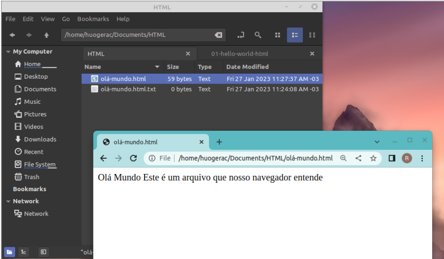
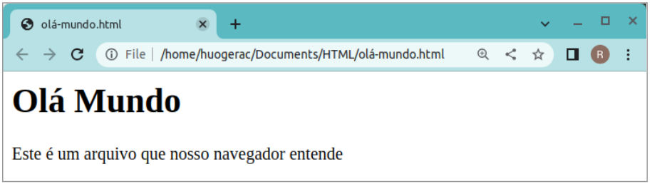
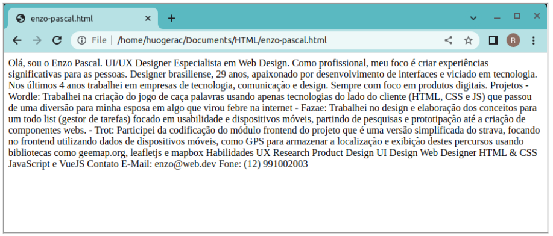
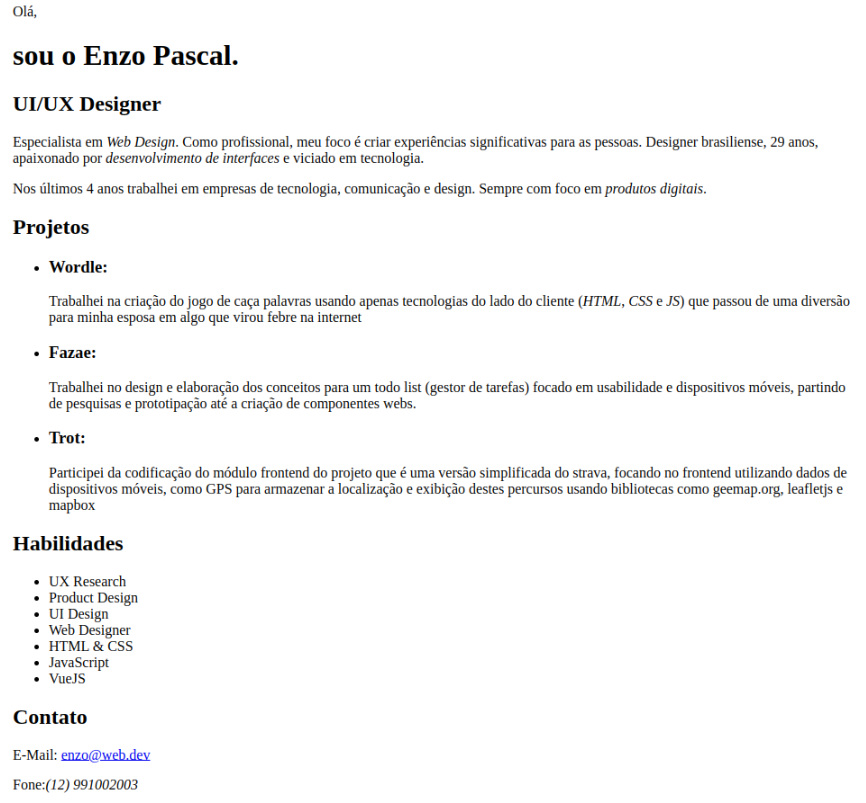

# Guia Definitivo Do Zero à Dev - EXERCÍCIOS

## HTML

### 🏆 1 - Olá Mundo

Crie um arquivo de texto com a extensão .html com o conteúdo abaixo:

```
Olá Mundo
Este é um arquivo que nosso navegador entende
```

Abra o arquivo em seu navegador



Agora altere o arquivo de forma a adicionar as tags html:

```
<h1>Olá Mundo</h1>
<p>Este é um arquivo que nosso navegador entende</p>
```

Salve o arquivo e clique em atualizar página do navegador.



Versão final do Olá Mundo HTML

```HTML
<!DOCTYPE html>
<html>
  <head>
    <title>Olá mundo HTML da DevPro</title>
  </head>
  <body>
    <h1>Olá Mundo</h1>
    <p>Este é um arquivo que nosso navegador entende</p>
  </body>
</html>
```

### 🏆 2 - Entendendo marcações HTML na prática

Usando o conteúdo abaixo, crie o arquivo enzo-pascal.html e digite ou copie e cole este conteúdo e veja como ele será exibido em seu navegador.

```HTML
Olá, sou o Enzo Pascal.
UI/UX Designer
Especialista em Web Design. Como profissional, meu foco é
criar experiências significativas para as pessoas.
Designer brasiliense, 29 anos, apaixonado por desenvolvimento de interfaces e
viciado em tecnologia. Nos últimos 4 anos trabalhei em empresas de tecnologia,
comunicação e design. Sempre com foco em produtos digitais.
Projetos
- Wordle: Trabalhei na criação do jogo de caça palavras usando apenas tecnologias do lado do cliente (HTML, CSS e JS) que passou de uma diversão para minha esposa em algo que virou febre na internet
- Fazae: Trabalhei no design e elaboração dos conceitos para um todo list (gestor de tarefas) focado em usabilidade e dispositivos móveis, partindo de pesquisas e prototipação até a criação de componentes webs.
- Trot: Participei da codificação do módulo frontend do projeto que é uma versão simplificada do strava, focando no frontend utilizando dados de dispositivos móveis, como GPS para armazenar a localização e exibição destes percursos usando bibliotecas como geemap.org, leafletjs e mapbox
Habilidades
UX Research
Product Design
UI Design
Web Designer
HTML & CSS
JavaScript e VueJS
Contato
E-Mail: enzo@web.dev
Fone: (12) 991002003
```

A saída do conteúdo acima no navegador sem fazer as marcações do html será como abaixo, ou seja, é como se tudo fosse apenas um parágrafo.



Abra o arquivo enzo-pascal.html com texto original no seu editor de texto e aplique os conhecimentos adquiridos sobre tags do HTML, será necessário criar a estrutura base do html, e para cada parte do conteúdo iremos precisar utilizar as tags corretas, como h1 e p, ul e li para os conteúdos de lista e assim por diante.
Depois de adicionar as marcações, a exibição do conteúdo deverá ser algo parecido com a visualização abaixo:


